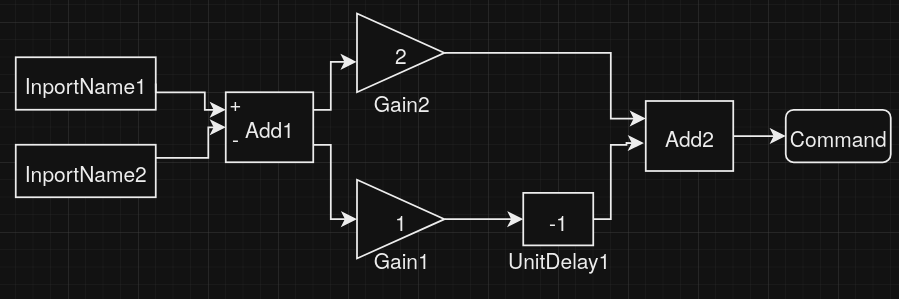

## Генератор Си кода из описанного формата блок-схем (XML -> Си)

### Dependencies:
- Boost v1.82
- (pugixml v1.14 [ref](https://github.com/zeux/pugixml) - compiled as third-party lib)
- CMake v3.28
- Doxygen v1.9

### Build:
```
mkdir build && cd build
cmake -DCMAKE_BUILD_TYPE=Release ..
cmake --build .
```

### Usage:
Help:
```
./translator -h
```

Default source:
```
./translator
```

Choose source:
```
./translator -s source.xml
```

### Concept:
U (от Universal) - язык, состоящий из конструкций по типу:
```
operatorName1(var1, var2, var3)
operatorName2(var1)
```

Пример кода на U:
```
sum(res, arg1, arg2)
inc(res)
```

Алгоритм:
```
1) XML -> Source Structures
2) Source Structures -> U
3) U -> Си
```

Пример входных данных:



В виде XML:
```
<?xml version="1.0" encoding="utf-8"?>
<System>
  <Block BlockType="Inport" Name="InportName1" SID="1">
  </Block>
  <Block BlockType="Inport" Name="InportName2" SID="2">
  </Block>
  <Block BlockType="Sum" Name="Add1" SID="3">
    <P Name="Inputs">+-</P>
  </Block>
  <Block BlockType="Sum" Name="Add2" SID="4">
  </Block>
  <Block BlockType="Gain" Name="Gain1" SID="5">
    <P Name="Gain">1</P>
  </Block>
  <Block BlockType="Gain" Name="Gain2" SID="6">
    <P Name="Gain">2</P>
  </Block>
  <Block BlockType="UnitDelay" Name="UnitDelay1" SID="7">
    <P Name="SampleTime">-1</P>
  </Block>
  <Block BlockType="Outport" Name="Command" SID="8">
  </Block>
  <Line>
    <P Name="Src">1#out:1</P>
    <P Name="Dst">3#in:1</P>
  </Line>
  <Line>
    <P Name="Src">2#out:1</P>
    <P Name="Dst">3#in:2</P>
  </Line>
  <Line>
    <P Name="Src">3#out:1</P>
    <Branch>
      <P Name="Dst">5#in:1</P>
    </Branch>
    <Branch>
      <P Name="Dst">6#in:1</P>
    </Branch>
  </Line>
  <Line>
    <P Name="Src">5#out:1</P>
    <P Name="Dst">7#in:1</P>
  </Line>
  <Line>
    <P Name="Src">6#out:1</P>
    <P Name="Dst">4#in:1</P>
  </Line>
  <Line>
    <P Name="Src">7#out:1</P>
    <P Name="Dst">4#in:2</P>
  </Line>
  <Line>
    <P Name="Src">4#out:1</P>
    <P Name="Dst">8#in:1</P>
  </Line>
</System>
```

Сгенерированный код:
```
<!-- TODO: add code example -->
```

### Docs:
- https://notzahar.github.io/translator/
